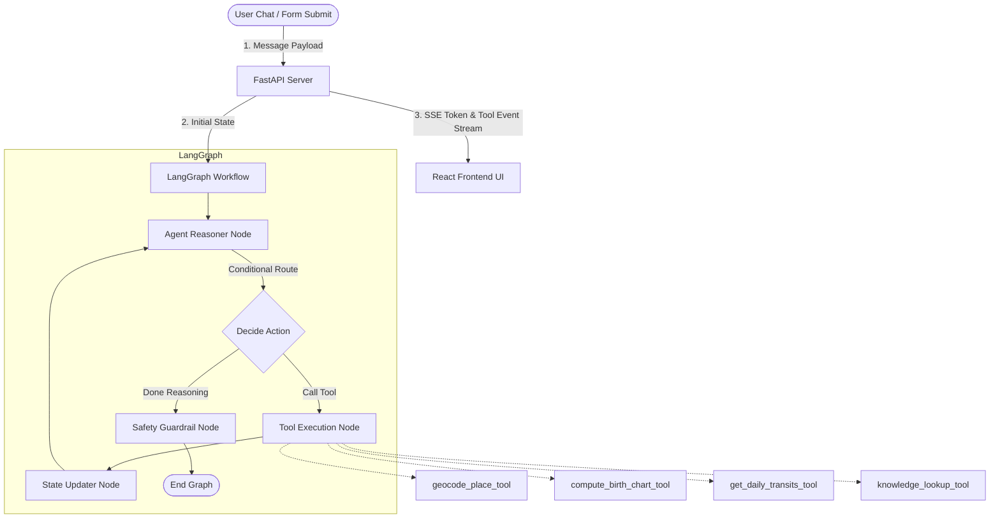

# AstroAgent 🌌 - Aradhana's Daily Spiritual Companion

AstroAgent is an agentic AI astrology companion. It allows seekers to share their birth details, compute their precise birth chart coordinates using a real Swiss Ephemeris, reason over transits, consult traditional text databases, and ask spiritual guidance questions in a warm, empathetic tone.

It is structured as a **FastAPI backend** running a **LangGraph stateful workflow** and a polished **React dashboard** styled with custom celestial aesthetics.

---

## Architecture Overview



### Components

1. **FastAPI Server**: Manages SSE connection loops, session parameters, and exposes geocoding endpoints.
2. **LangGraph Agent Workflow**:
   * **Agent Reasoner Node**: Decides whether to reply or call specialized tools.
   * **Tool Execution Node**: Executes Python tools for astronomy math and local databases.
   * **State Updater Node**: Parses tool output and keeps the shared graph state (`birth_details`, `chart_data`, etc.) in sync.
   * **Safety Guardrail Node**: Injects disclaimers and sanitizes replies if the conversation touches on medical, legal, or financial prediction certainty.
3. **Astrology Engine (`pyswisseph`)**: The official Swiss Ephemeris wrapper. Computers precise planetary longitudes, speeds, and house boundaries (Placidus/Equal system).
4. **Offline RAG Indexer**: A self-contained, pure-Python TF-IDF vector database querying curated astrological reference notes.
5. **React Dashboard**: Calm cosmic CSS theme featuring glassmorphism, responsive split panels, real-time tool state badges, and streaming message bubbles.

---

## Setup & Running Locally

### Prerequisites
* Python 3.13 (or 3.9+)
* Node.js (v18+)
* Local Ollama (running `llama3.1:8b`) or an API Key (OpenAI / Gemini)

### Backend Setup
1. Navigate to the `backend/` directory:
   ```bash
   cd backend
   ```
2. Create and activate a virtual environment:
   ```bash
   python -m venv venv
   # On Windows:
   .\venv\Scripts\activate
   # On macOS/Linux:
   source venv/bin/activate
   ```
3. Install dependencies:
   ```bash
   pip install -r requirements.txt
   ```
4. Configure `.env`:
   Create a `.env` file in the `backend/` folder (or copy `.env.example`).
   ```env
   # To use local Ollama:
   LLM_PROVIDER=ollama
   OLLAMA_MODEL=llama3.1:8b
   
   # Or to use Cloud LLMs:
   # LLM_PROVIDER=openai
   # OPENAI_API_KEY=your-openai-key
   
   # LLM_PROVIDER=gemini
   # GEMINI_API_KEY=your-gemini-key
   ```
5. Start the API server:
   ```bash
   uvicorn app.main:app --reload --port 8000
   ```

### Frontend Setup
1. Navigate to the `frontend/` directory:
   ```bash
   cd frontend
   ```
2. Install npm packages:
   ```bash
   npm install
   ```
3. Launch the Vite dev server:
   ```bash
   npm run dev
   ```
4. Open your browser and navigate to `http://localhost:5173`.

---

## Evaluation Harness 📊

The repository contains an automated evaluation runner and a committed golden set of 25 test cases verifying edge cases, invalid inputs, prompt injections, and safety disclaimers.

To execute the test suite and output the scorecard:
```bash
# From the project root directory
.\backend\venv\Scripts\python .\tests\evaluation\run_eval.py
```
This script compiles results into `EVALUATION.md`.

---

## Disclaimers & Safety Guardrails

At Aradhana, spiritual guidance is for reflection and self-understanding. The agent implements explicit safety checks:
* **Refusal and Disclaimers**: If a user asks for health diagnostics, disease cures, financial investments (e.g. buying stock/crypto), or legal trial predictions, the agent:
  1. States that astrology does not offer physical certainty.
  2. Encourages consulting licensed professionals.
  3. Appends a standardized disclaimer box at the bottom of the response.
* **Tone Guardrails**: Node post-processors enforce warmth, spiritual empathy, and respect.

---

## Known Limitations

1. **Ephemeris Size**: The Swiss Ephemeris calculations are done using built-in analytical theory rather than loading 30MB+ high-precision JPL data files. Precision is accurate within arcseconds, which is perfect for astrology, but not suitable for spacecraft navigation.
2. **Geocoding Offline Limits**: External geocoding is prone to rate-limits. To bypass this, we pre-loaded a lookup dictionary of 25+ major reference cities (Mumbai, San Francisco, London, etc.) which resolve instantly and offline. Other locations fall back dynamically to Nominatim.
3. **Local LLM Tool Binding**: Local models like Llama 3.1 are capable but occasionally struggle with formatting complex JSON parameter inputs compared to GPT-4o or Gemini. We recommend using Gemini or OpenAI in production.
